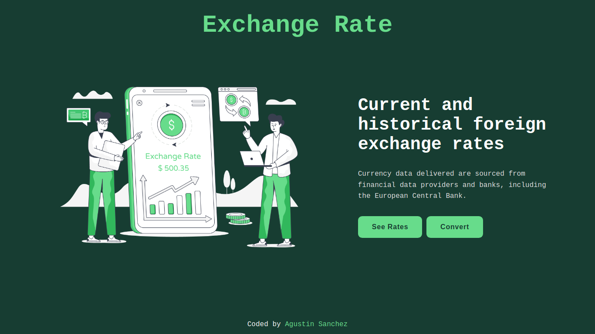
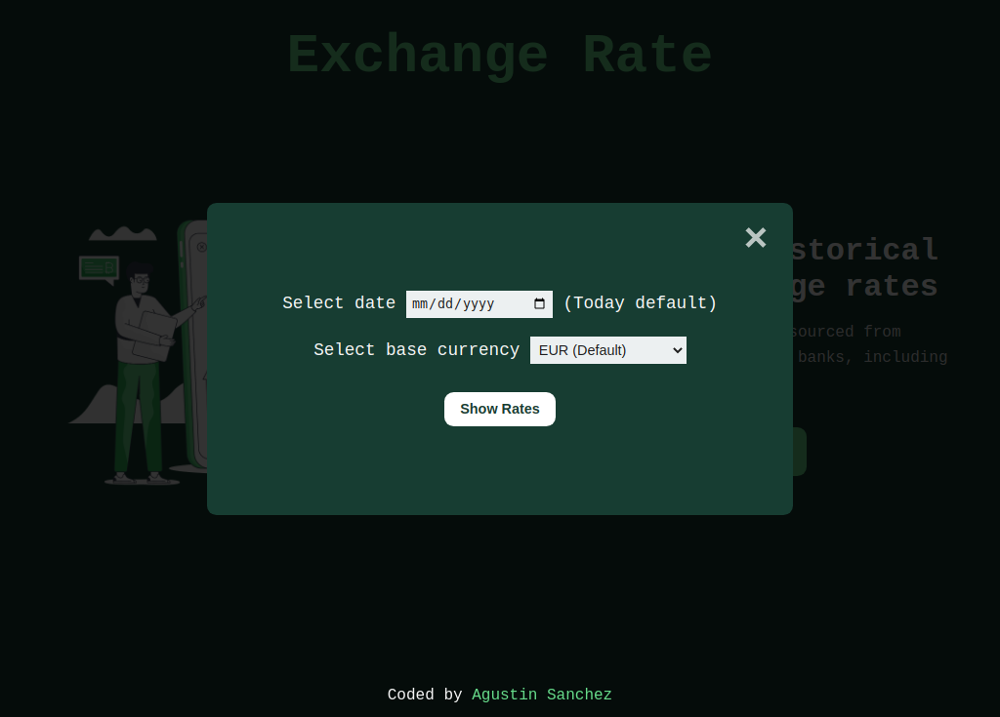
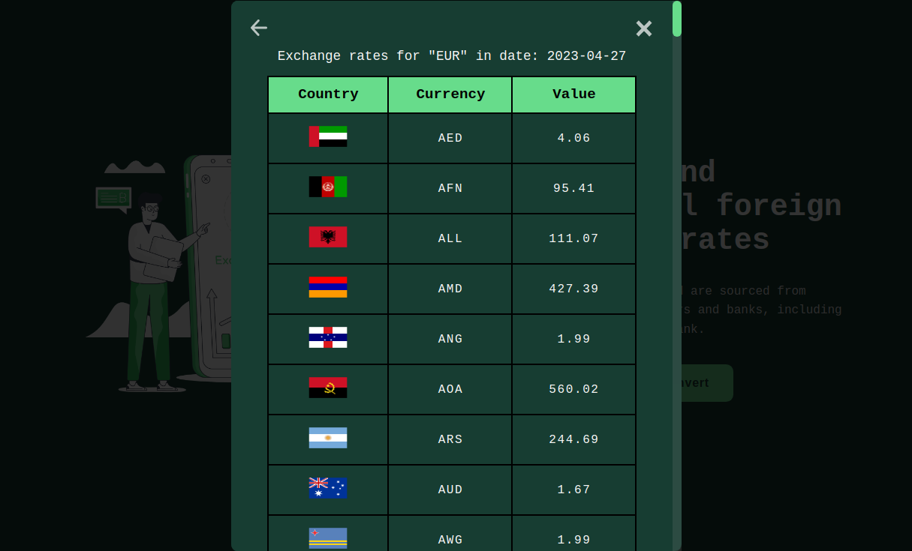
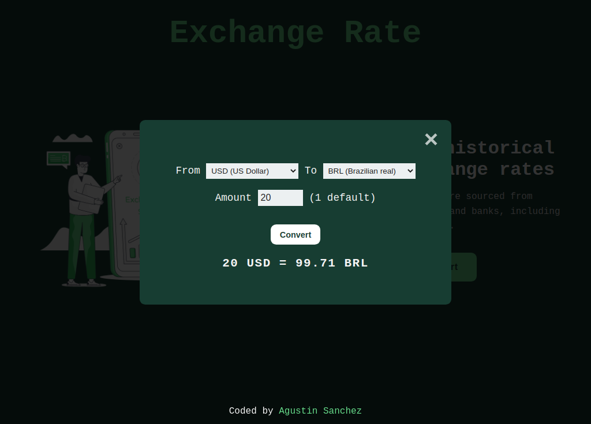
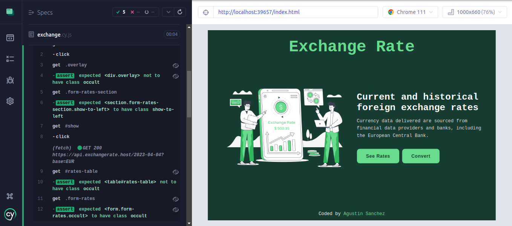

# Exchange rate

You can know the price of a country's money in relation to another country's money.
This application communicates with an external api bringing a list of currency exchanges based on a selected date and currency. This application also allows you to calculate the exchange rate between two currencies by specifying an amount.

Users should be able to:

- View the optimal layout depending on their device's screen size
- Look at the different exchange rates in many countries.
- Convert currencies with specific selected amount

## Screenshots

- Mobile view

## Links

- Deploy [Live site](https://exchange-rates-js.vercel.app/)
- Hero image from [Lovepik](https://lovepik.com/)
- API data from [exchangerate-host](https://exchangerate.host/#/)
- Flags images from [FlagsApi](https://flagsapi.com/)

## Built with

 
 
 
 

## Tests

### The UI was tested with

## Author

- Linkedin - [Agustin Emanuel Sanchez](https://www.linkedin.com/in/agustin-emanuel-sanchez-4b2807240/)
- Frontend Mentor - [@agusscript](https://www.frontendmentor.io/profile/agusscript)
- Twitter - [@agus_script](https://twitter.com/agus_script)
